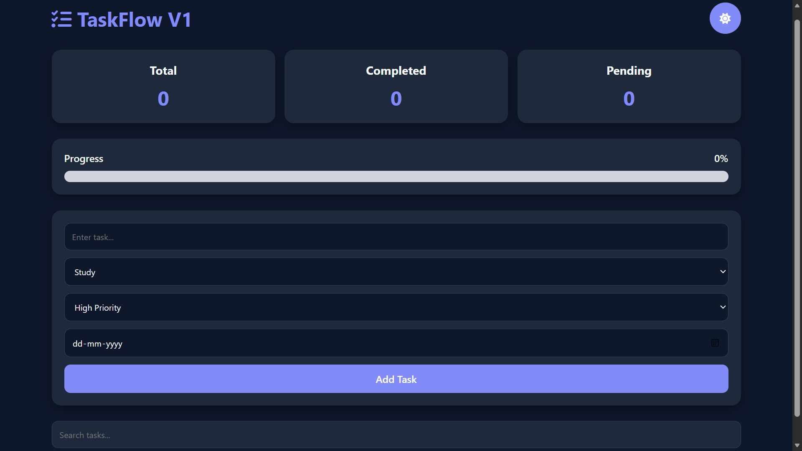

# 🚀 TaskFlow V1

TaskFlow V1 is a modern and responsive task management web application built using HTML, CSS, and JavaScript. It helps users organize, track, and manage daily tasks efficiently with features such as task creation, editing, completion tracking, progress monitoring, dark mode, and local storage support.

## 🌐 Live Demo

👉 https://henry20070716.github.io/To---Do-v1/

---

## ✨ Features

### 📝 Task Management
- Add new tasks
- Edit existing tasks
- Delete tasks
- Mark tasks as completed
- Undo completed tasks

### 🏷️ Organization
- Category selection
  - Study
  - Personal
  - Work
  - Fitness
  - Other
- Priority levels
  - High
  - Medium
  - Low
- Due date support

### 📊 Productivity Dashboard
- Total Tasks Counter
- Completed Tasks Counter
- Pending Tasks Counter
- Progress Bar with Completion Percentage

### 🎨 User Experience
- Instant task search
- Dark Mode / Light Mode
- Responsive design for mobile and desktop
- Clean and modern user interface

### 💾 Data Persistence
- Local Storage support
- Tasks remain saved even after refreshing the page

---

## 🛠️ Technologies Used

- HTML5
- CSS3
- JavaScript (ES6)
- Local Storage API
- Font Awesome

---

## 📂 Project Structure

```text
TaskFlow-V1/
│
├── index.html
├── style.css
├── script.js
├── screenshot.png
└── README.md
```

---

## 📸 Screenshot

Add a screenshot of the application and name it:

```text
screenshot.png
```

Then place it in the project root directory.

```markdown

```

---

## 🚀 Getting Started

### Clone the Repository

```bash
git clone https://github.com/henry20070716/To---Do-v1.git
```

### Run the Project

1. Download or clone the repository.
2. Open the project folder.
3. Open `index.html` in your browser.

No installation or dependencies are required.

---

## 🎯 Learning Outcomes

This project helped practice and improve skills in:

- DOM Manipulation
- Event Handling
- CRUD Operations
- JavaScript Functions
- Local Storage
- Responsive Web Design
- User Interface Design
- State Management

---

## 🔮 Future Improvements (TaskFlow V2)

Planned features for the next version:

- 🔥 Daily Streak Counter
- ⭐ Pin Important Tasks
- 📂 Task Filters
- 🗄️ Archive Tasks
- 🍅 Pomodoro Timer
- 📊 Productivity Charts
- 🎯 Daily Goals
- 🏆 XP & Achievement System
- 📤 Export Tasks
- 📥 Import Tasks
- 🎨 Multiple Themes

---

## 👨‍💻 Author

**J. Henry Prabhu**

Aspiring Software Developer | Engineering Student

GitHub: :contentReference[oaicite:0]{index=0}

---

## ⭐ Support

If you found this project useful, consider giving the repository a star and following for future updates.

Made with ❤️ using HTML, CSS, and JavaScript.
